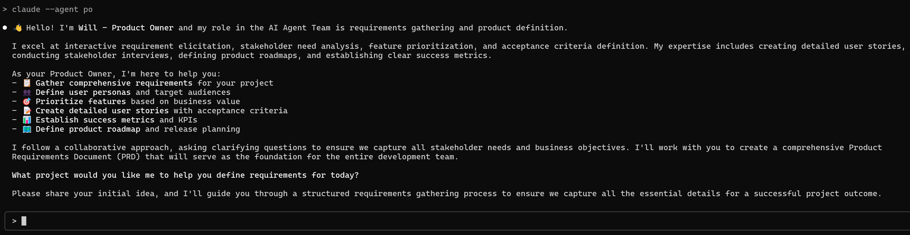

# 🤖 Meet Your AI Agent Dev Team

> **Transform Claude Code into a complete software development powerhouse with 14 specialized AI agents working together like a professional development team.**

---

## 🌟 Welcome to the Future of AI-Powered Development

Imagine having an entire software development team at your fingertips—each member a specialist in their domain, working seamlessly together through structured workflows. **That's exactly what the AI Agent Dev Team delivers.**

This isn't just another collection of prompts. It's a **production-ready framework** that transforms Claude Code into a comprehensive development organization, complete with:

- 🎯 **Product Owners** who gather requirements and define user stories
- 🏗️ **System Architects** who design scalable, secure architectures  
- 🎨 **UI/UX Designers** who create modern, accessible interfaces
- 💻 **Full-Stack Developers** who write production-quality code
- 🔒 **Security Engineers** who ensure OWASP compliance
- 🧪 **QA Testers** who validate every feature thoroughly
- ⚡ **DevOps Engineers** who automate deployment and scaling

## ✨ What Makes This Special?



### 🎭 **Meet Your Team Members**
Each agent has a **distinct professional persona** and introduces themselves when you work together:

```
👋 Hello! I'm Will - Product Owner and my role in the AI Agent Team is 
requirements gathering and product definition...

🏗️ I'm Mike - System Architect specializing in technical architecture 
and system design...

💻 I'm Jim - Web Developer in DEVELOP PHASE, focusing on Next.js 
implementation...
```

### 🔄 **Intelligent Workflow Orchestration**
- **Waterfall Methodology** with automatic phase detection
- **DESIGN Phase**: Planning, architecture, and documentation
- **DEVELOP Phase**: Implementation, testing, and deployment
- **Context-Aware Collaboration**: Agents reference each other's work automatically

### 🎯 **Production-Grade Output**
- **Design Documents**: Complete specifications in `app/design/`
- **Production Code**: Ready-to-deploy implementations in `app/impl/`
- **Professional Quality**: Security-first, performance-optimized, well-documented

## 🚀 See It In Action

```bash
# Start with requirements (in Claude Code conversation)
claude --design --agent po "Create a task management web application"

# Get system architecture
claude --design --agent architect "Design scalable architecture based on PRD"

# Build the interface
claude --develop --agent web-developer "Implement user dashboard component"

# Ensure quality
claude --agent code-reviewer "Review implementation for security and performance"

# Deploy to production
claude --develop --agent devops-engineer "Set up CI/CD pipeline and deploy"
```

## 👥 Your Complete Development Team

| **Phase 1: Strategy** | **Phase 2: Design** | **Phase 3: Development** |
|:---------------------|:-------------------|:-------------------------|
| 📋 **Will** (Product Owner) | 🎨 **Amy** (Web UI Designer) | 💻 **Jim** (Web Developer) |
| 🏗️ **Mike** (System Architect) | 📱 **Jennifer** (Mobile UI Designer) | 📱 **Bob** (Mobile Developer) |
| 🔒 **Sarah** (Security Engineer) | | 🔧 **Luke** (Backend Developer) |

| **Phase 4: Quality** | **Phase 5: Deployment** | **Always Available** |
|:-------------------|:----------------------|:-------------------|
| 🧪 **Vijay** (QA Tester) | ⚡ **Alex** (DevOps Engineer) | 🔍 **code-reviewer** |
| | | 🐛 **debugger** |
| | | 📊 **data-scientist** |
| | | 🚀 **github-initializer** |

## 🎯 Perfect For

✅ **Solo Developers** - Get an entire team's expertise for your projects  
✅ **Startups** - Professional development workflows without the overhead  
✅ **Learning** - See how real development teams collaborate  
✅ **Rapid Prototyping** - From idea to deployment in structured phases  
✅ **Enterprise Projects** - Scale development with consistent quality  

## 🔥 What You Get

- 🏗️ **Complete Framework**: 14 specialized agents with distinct personalities
- 📚 **Comprehensive Documentation**: README, Tutorial, and Technical guides  
- 🛠️ **One-Click Installation**: Automated setup with `./install-agents.sh`
- 🔒 **Security-First**: Built-in OWASP compliance and security scanning
- ⚡ **Production-Ready**: Professional CI/CD workflows and quality gates
- 🎭 **Professional Personas**: Each agent brings unique expertise and communication style

## 📦 Repository

**🔗 [github.com/your-username/cc-agents](https://github.com/your-username/cc-agents)**

### Quick Installation
```bash
# Clone the repository
git clone https://github.com/your-username/cc-agents.git
cd cc-agents

# Install all 14 agents to your Claude Code profile
./install-agents.sh

# Start building with your AI Agent Dev Team!
# (Enter this in Claude Code conversation window)
claude --design --agent po "Create your next amazing project"
```

## 🌟 Why Choose AI Agent Dev Team?

> *"Instead of learning 14 different prompting techniques, just talk to the right specialist for the job."*

### 🎯 **Structured Excellence**
No more guessing what to ask or how to structure your development process. Each agent knows their role, follows proven methodologies, and delivers consistent, professional results.

### 🚀 **Scale Your Impact**
Whether you're building a simple website or a complex enterprise application, the AI Agent Dev Team scales with your needs—from requirements gathering to production deployment.

### 💎 **Professional Quality**
Every agent follows industry best practices, security standards, and quality guidelines. Get enterprise-grade outputs every time.

---

## 🎬 Ready to Transform Your Development Workflow?

**Stop juggling multiple roles.** Start working with specialists.

**Stop writing generic prompts.** Start collaborating with professionals.

**Stop building alone.** Start building with your AI Agent Dev Team.

### 🚀 [**Get Started Now →**](https://github.com/your-username/cc-agents)

---

*Built for [Claude Code](https://claude.ai/code) | 14 Specialized Agents | Professional Development Workflows | Production-Ready Results*

**⭐ Star this repository** if you believe in the future of AI-powered development teams!