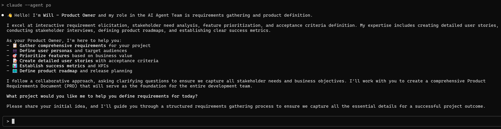
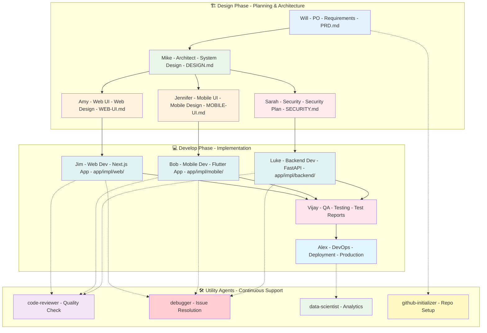
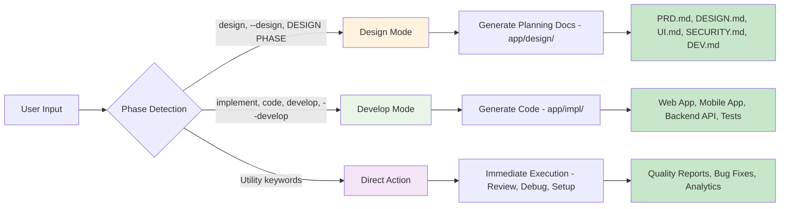
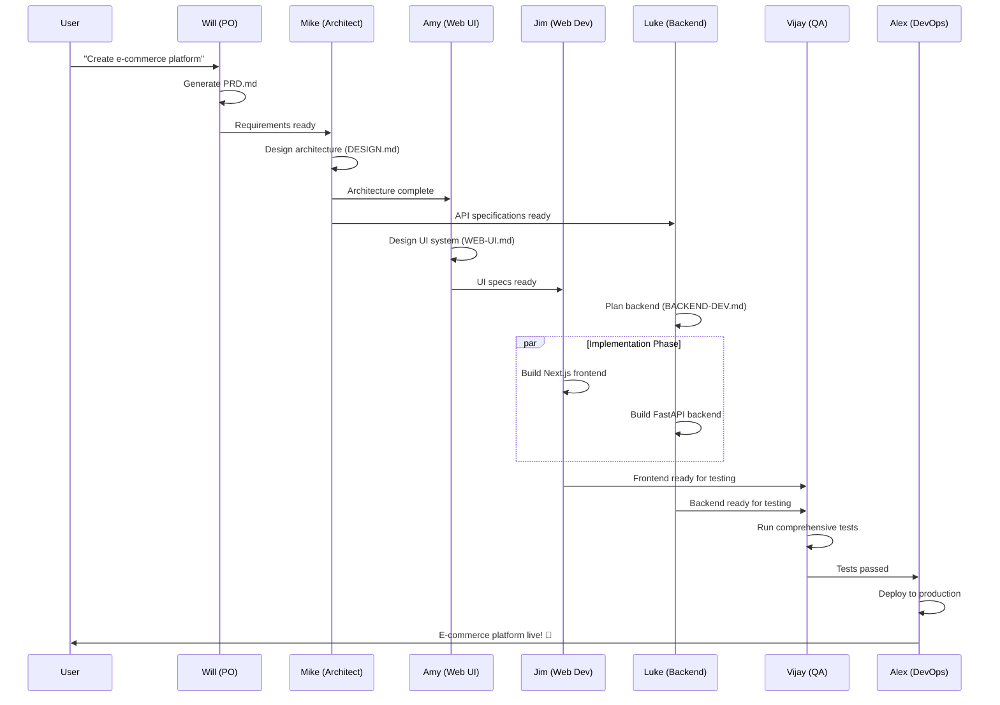

# 🤖 Claude Code AI Agent Dev Team Framework

> **A comprehensive 14-member AI Agent Development Team for complete software development lifecycle management**

[](https://claude.ai/code)
[](https://github.com/anthropics/claude-code)
[](LICENSE)
[](docs/)

This project provides a production-ready **14-member AI Agent Development Team** that follows structured waterfall methodology with intelligent phase detection, enabling complete software development lifecycle automation through Claude Code.

## 🚀 Quick Start

### Installation

```bash
# Clone the repository (in terminal)
git clone <your-repo-url>
cd cc-agents

# Install all 14 agents to your Claude Code profile (in terminal)
./install-agents.sh

# Or force install without prompts (overwrites existing agents)
./install-agents.sh --force
```

### Usage

**Important**: All agent commands below are entered in Claude Code's conversation window, not in your terminal.

```bash
# Start with requirements gathering (in Claude Code)
claude --design --agent po "Create a task management web application"

# Follow the waterfall methodology (in Claude Code)
claude --design --agent architect "Design scalable architecture based on PRD"
claude --design --agent web-ui-designer "Create modern UI design system"
claude --develop --agent web-developer "Implement dashboard component"
```

## 👥 Meet the Team

### 🏗️ **Core Development Team (10 Members)**

| Agent | Role | Specialization | Phase Support |
|-------|------|----------------|---------------|
| **Will (PO)** | Product Owner | Requirements & User Stories | Design |
| **Mike (Architect)** | System Architect | Technical Architecture & APIs | Design |
| **Amy (Web UI)** | Web UI Designer | Modern Web Design & UX | Design |
| **Jennifer (Mobile UI)** | Mobile UI Designer | Mobile-First Design & Accessibility | Design |
| **Sarah (Security)** | Security Engineer | Security Architecture & Compliance | Design |
| **Jim (Web Dev)** | Web Developer | Next.js, React, TypeScript | Design + Develop |
| **Bob (Mobile Dev)** | Mobile Developer | Flutter, Dart, Cross-Platform | Design + Develop |
| **Luke (Backend Dev)** | Backend Developer | Python, FastAPI, PostgreSQL | Design + Develop |
| **Vijay (QA)** | QA Tester | Testing Strategy & Automation | Design + Develop |
| **Alex (DevOps)** | DevOps Engineer | Infrastructure & CI/CD | Design + Develop |

### 🛠️ **Utility Agents (4 Members)**

| Agent | Purpose | When to Use |
|-------|---------|-------------|
| **code-reviewer** | Code Quality & Security | After writing/modifying code |
| **debugger** | Error Resolution | When encountering issues |
| **data-scientist** | Data Analysis & SQL | For data insights & analytics |
| **github-initializer** | Repository Setup | Project initialization |

## 🎭 Agent Identification System

**Every agent identifies themselves first when invoked!** This ensures clear communication about who's handling your request.



### Agent Identity Examples

| Command | Agent Response |
|---------|----------------|
| `claude --design --agent po "Create a web app"` | *"Hello! I'm **Will - Product Owner** and my role in the AI Agent Team is requirements gathering..."* |
| `claude --design --agent architect "Design the system"` | *"I'm **Mike - System Architect** specializing in technical architecture and system design..."* |
| `claude --develop --agent web-developer "Build dashboard"` | *"I'm **Jim - Web Developer in DEVELOP PHASE**, focusing on Next.js implementation..."* |
| `claude --agent code-reviewer "Review my code"` | *"I'm a **Code Review Specialist** ensuring high standards of code quality and security..."* |

### Phase-Aware Identification

Agents that work in both phases clearly state their current mode:
- **Design Phase**: *"Jim - Web Developer in DESIGN PHASE"* (creates planning documents)
- **Develop Phase**: *"Jim - Web Developer in DEVELOP PHASE"* (writes actual code)

### Professional Personas

Each agent has a distinct personality and expertise:
- **Will (PO)**: Collaborative requirements expert
- **Mike (Architect)**: Technical systems thinker  
- **Amy (Web UI)**: Modern web design specialist
- **Jennifer (Mobile UI)**: Mobile-first design expert
- **Sarah (Security)**: Security-conscious engineer
- **Jim (Web Dev)**: Next.js/React craftsman
- **Bob (Mobile Dev)**: Flutter/Dart specialist
- **Luke (Backend Dev)**: Python/FastAPI expert
- **Vijay (QA)**: Quality assurance professional
- **Alex (DevOps)**: Infrastructure automation expert

## 🎯 Key Features

- **🏗️ Waterfall Methodology**: Structured phase-based development
- **🤖 Intelligent Phase Detection**: Automatic DESIGN vs DEVELOP mode switching
- **👥 Agent Identification**: Each agent identifies themselves and their role
- **📁 Organized Output**: Design docs (`app/design/`) and implementation (`app/impl/`)
- **🔄 Agent Collaboration**: Sequential and parallel workflows
- **⚡ Production Ready**: Professional-grade code and architecture
- **🔐 Security First**: Built-in security best practices
- **📊 Quality Assurance**: Comprehensive testing and code review

## 📖 Documentation

- **[CLAUDE.md](CLAUDE.md)** - Complete agent configuration and technical details
- **[TUTORIAL.md](TUTORIAL.md)** - Comprehensive tutorial with practical examples
- **[docs/](docs/)** - Additional documentation and specifications

### Agent Communication Style

Agents provide:
✅ **Clear identification** - Who they are and their role  
✅ **Phase awareness** - Current mode (Design vs Develop)  
✅ **Context understanding** - Reference to previous work  
✅ **Professional expertise** - Specialized knowledge in their domain  

## 🔄 Development Workflow

### 📊 Complete Agent Team Workflow



### 🔀 Phase Detection System



## 🔄 Development Workflow

### 1. **Design Phase** - Architecture & Planning

**Note**: Enter these commands in Claude Code's conversation window.

```bash
claude --design --agent po "Create requirements for e-commerce platform"
claude --design --agent architect "Design microservices architecture"  
claude --design --agent web-ui-designer "Create modern UI design system"
claude --design --agent security-engineer "Define security requirements"
```

### 2. **Develop Phase** - Implementation

**Note**: Enter these commands in Claude Code's conversation window.

```bash
claude --develop --agent backend-developer "Implement user authentication API"
claude --develop --agent web-developer "Build product catalog component"
claude --develop --agent mobile-developer "Create shopping cart screen"
```

### 3. **Quality & Deployment**

**Note**: Enter these commands in Claude Code's conversation window.

```bash
claude --agent code-reviewer "Review recent implementation"
claude --develop --agent qa-tester "Run comprehensive test suite"
claude --develop --agent devops-engineer "Deploy to production"
```

## 💡 Example Projects

### 🛒 E-commerce Development Flow



## 💡 Example Projects

### Blog Platform

**Note**: Enter these commands in Claude Code's conversation window.

```bash
# Requirements & Architecture
claude --design --agent po "Modern blog platform with analytics"
claude --design --agent architect "Design scalable blog architecture"

# Implementation  
claude --develop --agent web-developer "Implement blog editor with MDX"
claude --develop --agent backend-developer "Create blog API with analytics"
```

### E-commerce Mobile App

**Note**: Enter these commands in Claude Code's conversation window.

```bash
# Mobile-first approach
claude --design --agent mobile-ui-designer "Design e-commerce mobile experience"
claude --develop --agent mobile-developer "Implement product catalog with search"
claude --develop --agent backend-developer "Create payment processing API"
```

## 🏗️ Output Structure

```
project/
├── app/
│   ├── design/          # Design Phase Documents
│   │   ├── PRD.md       # Product Requirements (Will)
│   │   ├── DESIGN.md    # System Architecture (Mike)
│   │   ├── WEB-UI.md    # Web UI Specs (Amy)
│   │   ├── MOBILE-UI.md # Mobile UI Specs (Jennifer)
│   │   ├── SECURITY.md  # Security Requirements (Sarah)
│   │   ├── WEB-DEV.md   # Web Development Plan (Jim)
│   │   ├── MOBILE-DEV.md# Mobile Development Plan (Bob)
│   │   ├── BACKEND-DEV.md# Backend Development Plan (Luke)
│   │   ├── QA-TEST.md   # Testing Strategy (Vijay)
│   │   └── DEVOPS.md    # Infrastructure Plan (Alex)
│   └── impl/            # Implementation Code
│       ├── web/         # Next.js application
│       ├── mobile/      # Flutter application  
│       ├── backend/     # FastAPI services
│       └── infrastructure/ # CI/CD & deployment
└── .github/
    └── workflows/       # Automated CI/CD pipelines
```

## 🎨 Technology Stack

### Frontend
- **Web**: Next.js 14+, React, TypeScript, shadcn/ui, Tailwind CSS
- **Mobile**: Flutter, Dart, Material Design

### Backend  
- **API**: Python, FastAPI, SQLAlchemy
- **Database**: SQLite (dev), PostgreSQL (prod)
- **Caching**: Redis

### Infrastructure
- **Containerization**: Docker, Kubernetes
- **CI/CD**: GitHub Actions, automated testing
- **Deployment**: Cloud-native, Infrastructure as Code

## 🔧 Advanced Usage

### Parallel Agent Execution

**Note**: Send multiple messages quickly in Claude Code's conversation window for parallel execution.

```bash
# Design multiple components simultaneously (send each in Claude Code)
claude --design --agent web-ui-designer "Design admin dashboard"
claude --design --agent mobile-ui-designer "Design mobile admin"
claude --design --agent security-engineer "Define admin security"
```

### Custom Workflows

**Note**: These are patterns to use in Claude Code's conversation window, not terminal aliases.

```bash
# Feature development workflow pattern (use in Claude Code)
# Step 1: claude --design --agent po "[feature description]"
# Step 2: claude --design --agent architect "[architecture for feature]"

# Implementation workflow pattern (use in Claude Code)
# Step 1: claude --develop --agent web-developer "[implement feature]"
# Step 2: claude --agent code-reviewer "[review implementation]"
```

## 🚨 Quality Standards

- **Code Quality**: ESLint, Prettier, TypeScript strict mode
- **Security**: OWASP Top 10 compliance, automated security scanning  
- **Testing**: 70% unit, 20% integration, 10% E2E testing
- **Performance**: Web Vitals optimization, mobile performance
- **Accessibility**: WCAG 2.1 AA compliance

## 🤝 Contributing

1. Fork the repository
2. Create feature branch (`git checkout -b feature/amazing-feature`)
3. Use agents for development (`claude --develop --agent web-developer "implement feature"`)
4. Run quality checks (`claude --agent code-reviewer "review changes"`)
5. Commit changes (`git commit -m 'Add amazing feature'`)
6. Push to branch (`git push origin feature/amazing-feature`)
7. Open Pull Request

## 📄 License

This project is licensed under the MIT License - see the [LICENSE](LICENSE) file for details.

## 🙏 Acknowledgments

- Built for [Claude Code](https://claude.ai/code) by Anthropic
- Inspired by modern software development best practices
- Waterfall methodology adapted for AI agent collaboration

---

**Start building with the AI Agent Dev Team today!** 🚀

**Remember**: Enter agent commands in Claude Code's conversation window:

```bash
claude --design --agent po "Create your next amazing project"
```