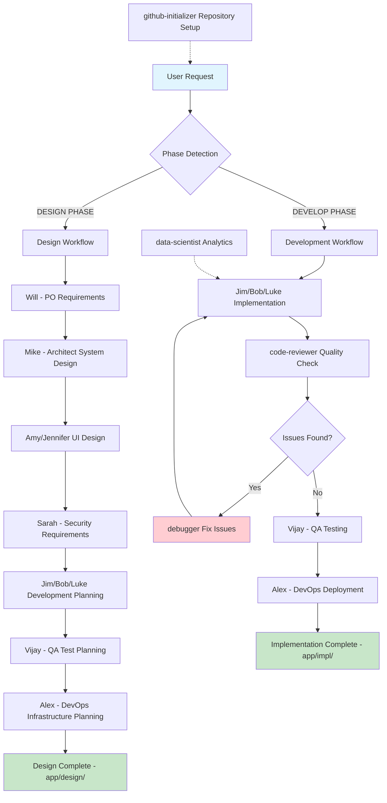
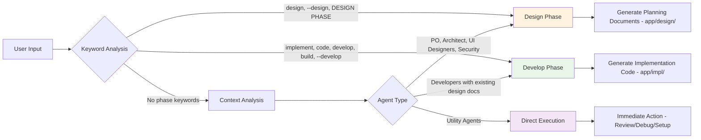
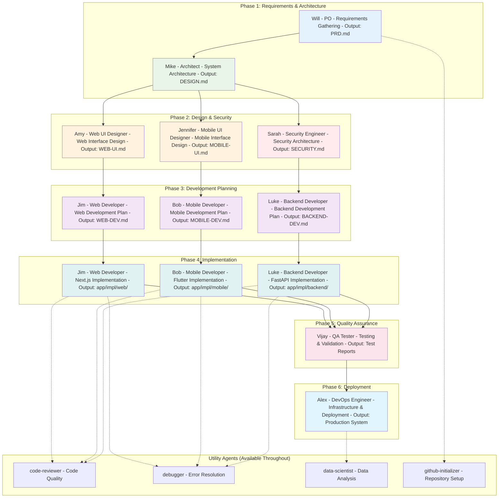
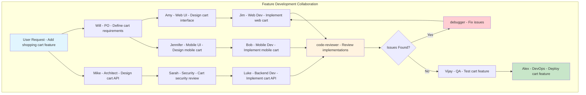
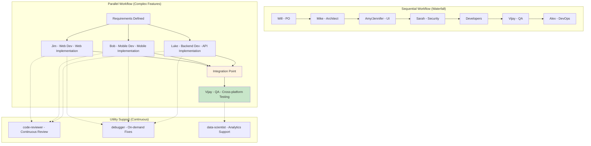

# AI Agent Dev Team Tutorial

This comprehensive tutorial demonstrates how to use the **14-member AI Agent Dev Team** for complete software development lifecycle management using Claude Code.

## 📚 Table of Contents

1. [Quick Start Guide](#-quick-start-guide)
2. [Phase-Based Development](#-phase-based-development)
3. [Practical Examples](#-practical-examples)
4. [Agent Workflows](#-agent-workflows)
5. [Advanced Usage Patterns](#-advanced-usage-patterns)
6. [Troubleshooting & Tips](#-troubleshooting--tips)

## 🚀 Quick Start Guide

### Basic Agent Invocation

**Important**: All agent commands below are typed in Claude Code's conversation message window, not in your terminal/CLI.

```bash
# Design phase - planning and architecture (Type in Claude Code conversation)
claude --design --agent po "I need a task management app"
claude --design --agent architect "Review PRD and design system architecture"

# Development phase - implementation (Type in Claude Code conversation)
claude --develop --agent web-developer "Implement user dashboard component"
claude --develop --agent backend-developer "Create task CRUD API endpoints"
```

### 🎭 What to Expect: Agent Identification

**Every agent identifies themselves first!** Here's what you'll see when you invoke agents:

#### Design Phase Agent Response Example
```
👋 Hello! I'm Will - Product Owner and my role in the AI Agent Team is 
requirements gathering and product definition. 

I excel at interactive requirement elicitation, stakeholder need analysis, 
feature prioritization, and acceptance criteria definition.

Let me help you create comprehensive requirements for your task management app...
```

#### Development Phase Agent Response Example
```
👨‍💻 I'm Jim - Web Developer in DEVELOP PHASE and my role in the AI Agent Team 
is Next.js, React, shadcn/ui, and Tailwind CSS development.

I'm currently in DEVELOP PHASE, so I'll focus on writing actual production 
code rather than planning. Let me first read my development plan from 
app/design/WEB-DEV.md to understand the implementation strategy...
```

#### Utility Agent Response Example
```
🔍 I'm a Code Review Specialist ensuring high standards of code quality 
and security. I'll run git diff to see recent changes and focus on 
modified files for a thorough review...
```

### 🎭 Agent Personas & Identification

Each agent has a unique personality and introduces themselves:

| Agent | Identity | Personality |
|-------|----------|-------------|
| **Will (PO)** | *"Will - Product Owner"* | Collaborative requirements expert |
| **Mike (Architect)** | *"Mike - System Architect"* | Technical systems thinker |
| **Amy (Web UI)** | *"Amy - Web UI Designer"* | Modern web design specialist |
| **Jennifer (Mobile UI)** | *"Jennifer - Mobile UI Designer"* | Mobile-first design expert |
| **Sarah (Security)** | *"Sarah - Security Engineer"* | Security-conscious engineer |
| **Jim (Web Dev)** | *"Jim - Web Developer [in PHASE]"* | Next.js/React craftsman |
| **Bob (Mobile Dev)** | *"Bob - Mobile Developer [in PHASE]"* | Flutter/Dart specialist |
| **Luke (Backend Dev)** | *"Luke - Backend Developer [in PHASE]"* | Python/FastAPI expert |
| **Vijay (QA)** | *"Vijay - QA Tester"* | Quality assurance professional |
| **Alex (DevOps)** | *"Alex - DevOps Engineer"* | Infrastructure automation expert |

### Phase Detection Keywords

| Phase | Triggers | Purpose |
|-------|----------|---------|
| **DESIGN** | `[DESIGN PHASE]`, `design`, `--design` | Planning, architecture, specifications |
| **DEVELOP** | `[DEVELOP PHASE]`, `implement`, `code`, `develop`, `build` | Implementation, coding, production |

## 🏗️ Phase-Based Development

### Design Phase Workflow

The design phase creates comprehensive planning documents in `app/design/` directory:

**Note**: All commands below are entered in Claude Code's conversation window, not your terminal.

```bash
# Step 1: Requirements Gathering (Type in Claude Code)
claude --design --agent po "Create PRD for e-commerce platform"
# Output: app/design/PRD.md

# Step 2: System Architecture (Type in Claude Code)
claude --design --agent architect "Design scalable e-commerce architecture"
# Output: app/design/DESIGN.md

# Step 3: UI/UX Design
claude --design --agent web-ui-designer "Design modern e-commerce UI"
claude --design --agent mobile-ui-designer "Design mobile shopping experience"
# Output: app/design/WEB-UI.md, app/design/MOBILE-UI.md

# Step 4: Security Planning
claude --design --agent security-engineer "Define security requirements"
# Output: app/design/SECURITY.md

# Step 5: Development Planning
claude --design --agent web-developer "Plan Next.js implementation"
claude --design --agent mobile-developer "Plan Flutter implementation"  
claude --design --agent backend-developer "Plan FastAPI implementation"
# Output: app/design/WEB-DEV.md, app/design/MOBILE-DEV.md, app/design/BACKEND-DEV.md

# Step 6: Quality & Infrastructure Planning
claude --design --agent qa-tester "Design comprehensive testing strategy"
claude --design --agent devops-engineer "Plan CI/CD and infrastructure"
# Output: app/design/QA-TEST.md, app/design/DEVOPS.md
```

### Development Phase Workflow

The development phase implements actual code in `app/impl/` directory:

**Note**: All commands below are entered in Claude Code's conversation window.

```bash
# Implementation phase - agents read their own design docs first
claude --develop --agent backend-developer "Implement user authentication API"
claude --develop --agent web-developer "Build product catalog component"
claude --develop --agent mobile-developer "Create shopping cart screen"

# Quality assurance and deployment
claude --develop --agent qa-tester "Run comprehensive test suite"
claude --develop --agent devops-engineer "Deploy to staging environment"
```

## 💡 Practical Examples

### Example 1: Building a Blog Platform

#### Step 1: Requirements & Architecture

**Note**: Enter these commands in Claude Code's conversation window.

```bash
# Product requirements
claude --design --agent po "Create a modern blog platform with user management, content creation, and analytics"

# System architecture  
claude --design --agent architect "Design scalable blog platform with Next.js frontend, FastAPI backend, and PostgreSQL"
```

**Expected Output**: 
- `app/design/PRD.md` - Detailed requirements with user stories
- `app/design/DESIGN.md` - Technical architecture with API specifications

#### Step 2: UI/UX Design

**Note**: Enter these commands in Claude Code's conversation window.

```bash
# Web interface design
claude --design --agent web-ui-designer "Design blog platform UI with modern design system, dark/light themes, and responsive layout"

# Mobile interface design  
claude --design --agent mobile-ui-designer "Design mobile blog reading experience with offline support"
```

**Expected Output**:
- `app/design/WEB-UI.md` - Web design system and component specifications
- `app/design/MOBILE-UI.md` - Mobile UI patterns and responsive design

#### Step 3: Security & Development Planning

**Note**: Enter these commands in Claude Code's conversation window.

```bash
# Security requirements
claude --design --agent security-engineer "Define security requirements for blog platform with user authentication and content protection"

# Development planning
claude --design --agent backend-developer "Plan FastAPI implementation with JWT auth, blog CRUD, and analytics"
claude --design --agent web-developer "Plan Next.js implementation with SSG, MDX support, and admin dashboard"
```

#### Step 4: Implementation

**Note**: Enter these commands in Claude Code's conversation window.

```bash
# Backend implementation
claude --develop --agent backend-developer "Implement blog post CRUD API with categories and tags"

# Frontend implementation
claude --develop --agent web-developer "Implement blog post editor with MDX support and live preview"

# Testing and deployment
claude --develop --agent qa-tester "Create test suite for blog functionality"
claude --develop --agent devops-engineer "Set up CI/CD pipeline with automated testing"
```

### Example 2: E-commerce Mobile App

#### Complete Development Cycle

**Note**: All commands below are entered in Claude Code's conversation window.

```bash
# 1. Requirements gathering
claude --design --agent po "Create requirements for mobile e-commerce app with product catalog, shopping cart, and payment integration"

# 2. Architecture design
claude --design --agent architect "Design microservices architecture for e-commerce with product service, cart service, and payment service"

# 3. Mobile UI design
claude --design --agent mobile-ui-designer "Design e-commerce mobile app with product browsing, cart management, and checkout flow"

# 4. Security planning
claude --design --agent security-engineer "Define security requirements for e-commerce with PCI compliance and data protection"

# 5. Development planning
claude --design --agent mobile-developer "Plan Flutter e-commerce app with state management and API integration"
claude --design --agent backend-developer "Plan FastAPI e-commerce backend with payment processing"

# 6. Implementation
claude --develop --agent mobile-developer "Implement product catalog screen with search and filters"
claude --develop --agent backend-developer "Implement payment processing API with Stripe integration"

# 7. Quality assurance
claude --develop --agent qa-tester "Create automated test suite for e-commerce functionality"
```

## 🔄 Agent Workflows

### 📊 Complete Development Workflow



### 🔀 Phase Detection Flow



### 🏗️ Waterfall Methodology Flow



## 🔄 Agent Workflows

### Utility Agent Usage

#### Code Review Workflow

```bash
# After making code changes (in terminal)
git add .
# Then in Claude Code conversation window:
claude --agent code-reviewer "Review recent changes for quality and security"

# Output: Detailed review with:
# - Critical issues (must fix)
# - Warnings (should fix)  
# - Suggestions (consider improving)
```

#### Debugging Workflow

```bash
# When encountering errors (in Claude Code conversation window)
claude --agent debugger "Application crashes with TypeError on user login"

# Process:
# 1. Analyzes error messages and stack traces
# 2. Identifies reproduction steps
# 3. Isolates failure location
# 4. Implements minimal fix
# 5. Verifies solution works
```

#### Data Analysis Workflow

```bash
# For data analysis tasks (in Claude Code conversation window)
claude --agent data-scientist "Analyze user engagement metrics from the past month"

# Process:
# 1. Writes optimized SQL queries
# 2. Uses BigQuery CLI tools
# 3. Analyzes and summarizes results
# 4. Provides data-driven recommendations
```

#### Repository Setup Workflow

```bash
# Setting up new project for GitHub (in Claude Code conversation window)
claude --agent github-initializer "Initialize this project for GitHub with comprehensive CI/CD workflows"

# Creates:
# - MIT LICENSE file
# - Professional README.md with badges
# - Appropriate .gitignore
# - .github/workflows/ci.yml with:
#   - Static code analysis
#   - Security scanning
#   - Automated testing
#   - Multi-language linting
```

### 🤝 Agent Collaboration Patterns



### 🔄 Parallel vs Sequential Workflows



### Collaborative Agent Workflows

#### Feature Development Workflow

**Note**: All commands below are entered in Claude Code's conversation window.

```bash
# 1. Requirements and design
claude --design --agent po "Add real-time chat feature to the application"
claude --design --agent architect "Design WebSocket-based chat architecture"

# 2. Implementation planning
claude --design --agent web-developer "Plan chat UI components and state management"
claude --design --agent backend-developer "Plan WebSocket chat API and message storage"

# 3. Development
claude --develop --agent web-developer "Implement chat UI with message bubbles and typing indicators"
claude --develop --agent backend-developer "Implement WebSocket chat server with Redis pub/sub"

# 4. Quality assurance
claude --agent code-reviewer "Review chat implementation for security and performance"
claude --develop --agent qa-tester "Create integration tests for real-time chat"

# 5. Deployment
claude --develop --agent devops-engineer "Deploy chat feature with WebSocket load balancing"
```

#### Bug Fix Workflow

```bash
# 1. Error identification
claude --agent debugger "User reports login not working on mobile Safari"

# 2. Code review for related issues
claude --agent code-reviewer "Review authentication code for browser compatibility"

# 3. Fix implementation
claude --develop --agent web-developer "Fix Safari compatibility issue in login form"

# 4. Testing
claude --develop --agent qa-tester "Test login functionality across all browsers"
```

## 🎯 Advanced Usage Patterns

### Multi-Agent Parallel Execution

**Note**: Enter each command in Claude Code's conversation window. You can send multiple messages quickly for parallel execution.

```bash
# Send these messages in Claude Code (one after another for parallel execution)
claude --design --agent web-ui-designer "Design admin dashboard UI"
claude --design --agent mobile-ui-designer "Design mobile admin interface"
claude --design --agent security-engineer "Define admin security requirements"

# Then proceed with implementation (send these in Claude Code)
claude --develop --agent web-developer "Implement admin dashboard"
claude --develop --agent mobile-developer "Implement mobile admin app"
```

### Context-Aware Agent Chains

**Note**: Enter these commands in Claude Code's conversation window.

```bash
# Agents automatically reference previous work
claude --design --agent architect "Design the system"  # Creates DESIGN.md
claude --design --agent security-engineer "Review architecture and add security"  # Reads DESIGN.md automatically
claude --design --agent backend-developer "Plan implementation"  # Reads DESIGN.md and SECURITY.md
```

### Custom Agent Combinations

**Note**: Enter these commands in Claude Code's conversation window.

```bash
# Complex workflow with custom triggers
claude --design --agent po "E-commerce platform with AI recommendations"
claude --design --agent architect "Include ML service in architecture"
claude --agent data-scientist "Design recommendation algorithm with user behavior data"
claude --design --agent backend-developer "Plan ML API integration"
```

## 🔧 Troubleshooting & Tips

### Common Issues

#### 1. **Agent Not Following Phase**
```bash
# Problem: Agent is coding when you want planning
# Solution: Use explicit phase triggers (in Claude Code conversation window)
claude --design --agent web-developer "Plan the implementation"  # ✅ Good
claude --agent web-developer "Plan the implementation"           # ❌ Might start coding
```

#### 2. **Missing Context Between Agents**
```bash
# Problem: Agent doesn't reference previous work
# Solution: Ensure design documents exist in app/design/
ls app/design/  # Check for PRD.md, DESIGN.md, etc.
```

#### 3. **Wrong Output Location**
```bash
# Problem: Code in wrong directory
# Solution: Agents use specific output patterns
# Design phase: app/design/*.md
# Develop phase: app/impl/*
```

### Best Practices

#### 1. **Follow Waterfall Sequence**
```bash
# Correct order for new projects:
# 1. PO → 2. Architect → 3. UI Designers → 4. Security → 5. Developers → 6. QA → 7. DevOps
```

#### 2. **Use Descriptive Prompts**
```bash
# ✅ Good: Specific and clear (in Claude Code conversation window)
claude --design --agent backend-developer "Plan FastAPI implementation with JWT authentication, PostgreSQL database, and Redis caching"

# ❌ Bad: Vague and unclear (in Claude Code conversation window)
claude --agent backend-developer "Make the backend"
```

#### 3. **Leverage Agent Specializations**
```bash
# Use the right agent for the task (in Claude Code conversation window)
claude --agent code-reviewer       # After writing code
claude --agent debugger           # When encountering errors  
claude --agent data-scientist     # For data analysis
claude --agent github-initializer # For repository setup
```

#### 4. **Monitor Output Locations**
```bash
# Check design documents
ls app/design/
# PRD.md, DESIGN.md, WEB-UI.md, SECURITY.md, etc.

# Check implementation code
ls app/impl/
# Actual source code, tests, configurations
```

### Advanced Tips

#### 1. **Custom Workflows**
```bash
# Create custom development flows (save common patterns for Claude Code)
# Quick setup pattern: first run github-initializer, then po agent
# Full design pattern: run po, architect, then web-ui-designer agents
# (Enter each command separately in Claude Code conversation window)
```

#### 2. **Quality Gates**
```bash
# Always run after development (in Claude Code conversation window)
claude --develop --agent web-developer "Implement feature"
claude --agent code-reviewer "Review the implementation"  # Quality gate
claude --develop --agent qa-tester "Test the feature"     # Quality gate
```

#### 3. **Documentation Generation**
```bash
# Generate comprehensive documentation (in Claude Code conversation window)
claude --design --agent architect "Document the complete system architecture"
claude --agent github-initializer "Create professional README with architecture diagrams"
```

## 📖 Reference Commands

### Quick Command Reference

**Note**: All commands below are entered in Claude Code's conversation window.

```bash
# Phase-based development
claude --design --agent <agent-name> "description"
claude --develop --agent <agent-name> "description"

# Utility agents (no phase needed)
claude --agent code-reviewer "review recent changes"
claude --agent debugger "fix login error"  
claude --agent data-scientist "analyze user metrics"
claude --agent github-initializer "setup repository"

# Check agent outputs
ls app/design/    # Design documents
ls app/impl/      # Implementation code
```

### Agent Reference Table

| Agent | Phase | Output Location | Primary Function |
|-------|-------|-----------------|------------------|
| **Will (PO)** | Design | `app/design/PRD.md` | Requirements gathering |
| **Mike (Architect)** | Design | `app/design/DESIGN.md` | System architecture |
| **Amy (Web UI)** | Design | `app/design/WEB-UI.md` | Web interface design |
| **Jennifer (Mobile UI)** | Design | `app/design/MOBILE-UI.md` | Mobile interface design |
| **Sarah (Security)** | Design | `app/design/SECURITY.md` | Security requirements |
| **Jim (Web Dev)** | Both | `app/design/WEB-DEV.md` / `app/impl/` | Web development |
| **Bob (Mobile Dev)** | Both | `app/design/MOBILE-DEV.md` / `app/impl/` | Mobile development |
| **Luke (Backend Dev)** | Both | `app/design/BACKEND-DEV.md` / `app/impl/` | Backend development |
| **Vijay (QA)** | Both | `app/design/QA-TEST.md` / `app/impl/` | Quality assurance |
| **Alex (DevOps)** | Both | `app/design/DEVOPS.md` / `app/impl/` | Infrastructure & deployment |
| **code-reviewer** | N/A | Feedback | Code quality review |
| **debugger** | N/A | Fixes | Error resolution |
| **data-scientist** | N/A | Analysis | Data insights |
| **github-initializer** | N/A | Repository files | GitHub setup |

## 💬 Agent Communication Examples

### Expected Agent Responses by Type

#### Product Owner (Will) Response Pattern
```
👋 Hello! I'm Will - Product Owner and my role in the AI Agent Team is 
requirements gathering and product definition.

I excel at interactive requirement elicitation, stakeholder need analysis, 
feature prioritization, and acceptance criteria definition.

Let me help you create comprehensive requirements for [your project]. 
First, let me ask some clarifying questions about:
1. Target users and personas
2. Core business objectives
3. Success metrics and KPIs
...
```

#### System Architect (Mike) Response Pattern
```
🏗️ I'm Mike - System Architect specializing in technical architecture and 
system design. I'll review the Product Requirements Document (PRD) thoroughly 
and design comprehensive system architecture based on requirements.

Based on the requirements, I recommend:
1. Technology stack selection
2. Component architecture design
3. API specifications and data models
4. Security and scalability planning
...
```

#### Developer Phase-Aware Responses

**Design Phase Example:**
```
🌐 I'm Jim - Web Developer in DESIGN PHASE and my role in the AI Agent Team 
is Next.js, React, shadcn/ui, and Tailwind CSS development.

I'll create comprehensive web development plans and generate detailed 
app/design/WEB-DEV.md with implementation roadmap, focusing on planning 
rather than coding.
```

**Develop Phase Example:**
```
👨‍💻 I'm Jim - Web Developer in DEVELOP PHASE focusing on Next.js implementation.

First, let me read my implementation plan from app/design/WEB-DEV.md to 
understand the architecture. I'll now implement actual React/Next.js code 
following the established patterns and component structure.
```

#### Utility Agent Response Examples

**Code Reviewer:**
```
🔍 I'm a Code Review Specialist ensuring high standards of code quality 
and security. I'll run git diff to see recent changes and focus on modified 
files for a thorough review.

✅ CRITICAL ISSUES (must fix): [list]
⚠️ WARNINGS (should fix): [list]
💡 SUGGESTIONS (consider improving): [list]
```

**Debugger:**
```
🛠️ I'm a Debugging Specialist for error resolution and troubleshooting. 
I'll analyze the error messages, identify the root cause, and implement 
a minimal fix to resolve the issue.

Error Analysis:
1. Reproduction steps identification
2. Stack trace analysis
3. Root cause isolation
4. Solution implementation
```

### Communication Benefits

✅ **Clear Identification** - Always know who's working on your request  
✅ **Phase Awareness** - Understand whether you're in planning or coding mode  
✅ **Context Understanding** - Agents reference previous work automatically  
✅ **Professional Expertise** - Each agent brings specialized domain knowledge  
✅ **Consistent Experience** - Predictable interaction patterns across all agents  

---

*AI Agent Dev Team Tutorial | Complete Development Lifecycle | 14 Specialized Agents*